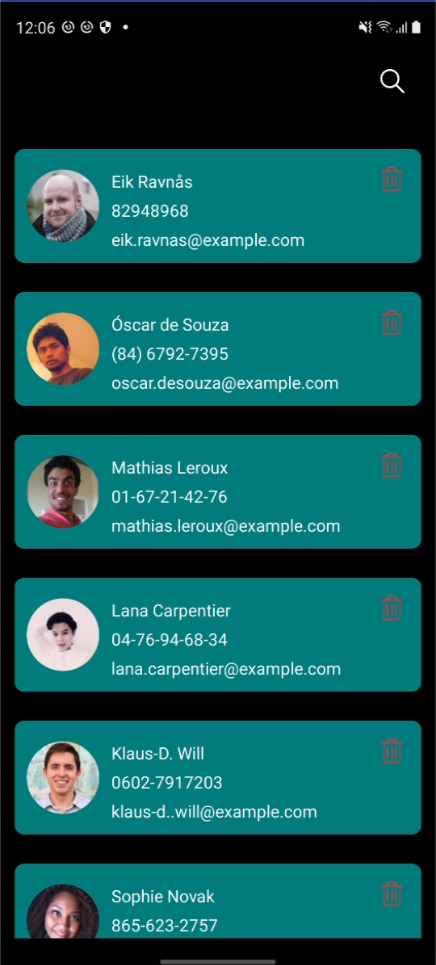
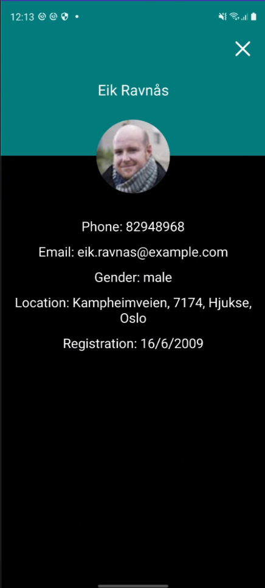

# Random users app

## Introduction
The app have 3 main activities
	
* Splash Activity: we check the the connectivity and we show a pop up to the user if the user doesn't have connectivity the user can decide if he/she wants to continue.

* All Users Activity: we display a list of 10 random users and when the user scroll down we load the following 10. In this activity we had a search option where the user can look for user by name, surname and email. The user can delete users by clicking the bin displayed in each user. When we load this screen we check if there are users in the database if there are no useres we get the users from the server and we save this users to the database, and every time that the user scrolls down if there is no more data in the database we get from the server and we add this new data to the database.
On click on user we open Single User Activity

* Single User Activity: in this activity we display the basic information from the seclected user. We get this data from the database using the unique id of the user.

## Used Technologies

I've decided to use coroutines to do the interaction between the viewmodel and the server calls. To obtain a faster response and more detailed state of the process by using Resource that have 3 diferent states (Success, Error, Loading)
I've decided to use rxjava to do the interaction between the viewmodel and the database calls. Database calls have to be done in background so rxjava it's helping me to do this kind of calls and then get the data back to the main thread.

* For the unit tests I've used mockito kotlin, mockk, kotlin coroutines test
* For the integration tests I've used espresso
* For the animations I've used lottie library
* For the database I've used room library
* For dependency injection I've used koin
* For the images I've used glide
* To init the api I've used retrofit with moshi

## Screenshots
Splash Activity

All Users Activity

Single User Activity

